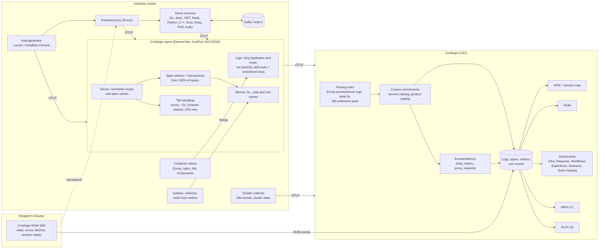

# Option A: end to end

```mermaid
flowchart LR
  subgraph browser["Shopper's browser"]
    rum["Coralogix RUM SDK<br/>vitals, errors, fetches, session replay"]
  end

  subgraph k8s["minikube cluster"]
    lg["load-generator<br/>Locust + headless Chrome"]
    proxy["frontend-proxy (Envoy)"]
    svcs["Demo services<br/>Go, Java, .NET, Node, Python, C++, Rust, Ruby, PHP, Kotlin"]
    kafka[("Kafka 'orders'")]
    stdout["Container stdout<br/>Envoy, nginx, k8s components"]
    node["kubelet, cAdvisor,<br/>node host metrics"]

    subgraph agent["Coralogix agent (DaemonSet, hostPort 4317/4318)"]
      direction TB
      a_logs["Logs: drop duplicates and noise,<br/>set severity, add route + enrichment keys"]
      a_traces["Traces: normalize routes and span names"]
      a_spanm["Span metrics + transactions<br/>from 100% of spans"]
      a_tail["Tail sampling<br/>errors, &gt;2s, browser-started, 10% rest"]
      a_metrics["Metrics: fix _total and unit names"]
      a_traces --> a_spanm
      a_traces --> a_tail
      a_spanm --> a_metrics
    end

    cluster["Cluster collector<br/>k8s events, cluster state"]
  end

  subgraph cx["Coralogix (US2)"]
    direction TB
    parse["Parsing rules<br/>Envoy access/server logs, body fix,<br/>k8s extension pack"]
    enrich["Custom enrichments<br/>service catalog, product catalog"]
    e2m["Events2Metrics<br/>shop_orders, proxy_requests"]
    store[("Logs, spans, metrics,<br/>rum.events")]
    apm["APM + service map"]
    rumui["RUM"]
    dash["Dashboards<br/>Infra, Requests, Workflows,<br/>Experience, Business, Team Catalog"]
    alerts["Alerts (7)"]
    slo["SLOs (3)"]
    parse --> enrich --> store
    enrich --> e2m --> store
    store --> apm
    store --> rumui
    store --> dash
    store --> alerts
    store --> slo
  end

  lg --> proxy
  rum -. "traceparent" .-> proxy
  proxy --> svcs
  svcs <--> kafka
  svcs -- "OTLP" --> agent
  proxy -- "OTLP" --> agent
  lg -- "OTLP" --> agent
  stdout -- "filelog" --> a_logs
  node --> a_metrics
  agent -- "OTLP" --> cx
  cluster -- "OTLP" --> cx
  rum -- "RUM events" --> store
```
