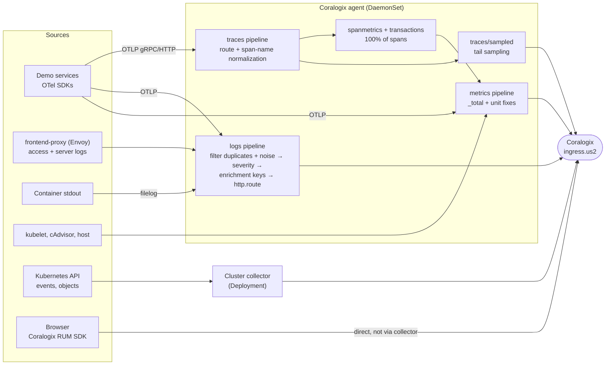
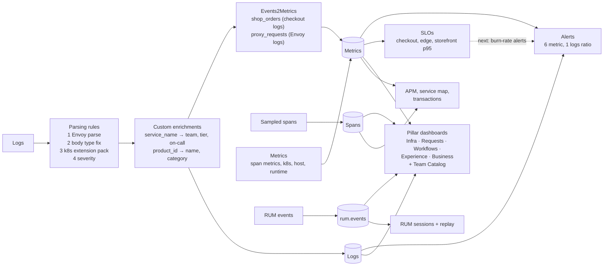

# Option B: cluster side, then Coralogix side

## B1: getting telemetry out of the cluster

```mermaid
flowchart LR
  subgraph sources["Sources"]
    svcs["Demo services<br/>OTel SDKs"]
    proxy["frontend-proxy (Envoy)<br/>access + server logs"]
    stdout["Container stdout"]
    node["kubelet, cAdvisor, host"]
    k8sapi["Kubernetes API<br/>events, objects"]
    browser["Browser<br/>Coralogix RUM SDK"]
  end

  subgraph agent["Coralogix agent (DaemonSet)"]
    direction TB
    logs["logs pipeline<br/>filter duplicates + noise → severity →<br/>enrichment keys → http.route"]
    traces["traces pipeline<br/>route + span-name normalization"]
    spanm["spanmetrics + transactions<br/>100% of spans"]
    sampled["traces/sampled<br/>tail sampling"]
    metrics["metrics pipeline<br/>_total + unit fixes"]
    traces --> spanm --> metrics
    traces --> sampled
  end

  cluster["Cluster collector<br/>(Deployment)"]
  cx(["Coralogix<br/>ingress.us2"])

  svcs -- "OTLP gRPC/HTTP" --> traces
  svcs -- "OTLP" --> logs
  svcs -- "OTLP" --> metrics
  proxy --> logs
  stdout -- "filelog" --> logs
  node --> metrics
  k8sapi --> cluster
  logs --> cx
  metrics --> cx
  sampled --> cx
  cluster --> cx
  browser -- "direct, not via collector" --> cx
```

## B2: inside Coralogix

```mermaid
flowchart LR
  in_logs["Logs"] --> parse["Parsing rules<br/>1 Envoy parse<br/>2 body type fix<br/>3 k8s extension pack<br/>4 severity"]
  parse --> enrich["Custom enrichments<br/>service_name → team, tier, on-call<br/>product_id → name, category"]
  enrich --> logs[("Logs")]
  enrich --> e2m["Events2Metrics<br/>shop_orders (checkout logs)<br/>proxy_requests (Envoy logs)"]

  in_spans["Sampled spans"] --> spans[("Spans")]
  in_metrics["Metrics<br/>span metrics, k8s, host, runtime"] --> metrics[("Metrics")]
  e2m --> metrics
  in_rum["RUM events"] --> rum[("rum.events")]

  spans --> apm["APM, service map,<br/>transactions"]
  metrics --> apm
  rum --> rumui["RUM sessions + replay"]

  logs --> dash["Pillar dashboards<br/>Infra · Requests · Workflows ·<br/>Experience · Business<br/>+ Team Catalog"]
  spans --> dash
  metrics --> dash
  rum --> dash

  metrics --> slo["SLOs<br/>checkout, edge, storefront p95"]
  metrics --> alerts["Alerts<br/>6 metric, 1 logs ratio"]
  logs --> alerts
  slo -. "next: burn-rate alerts" .-> alerts
```
