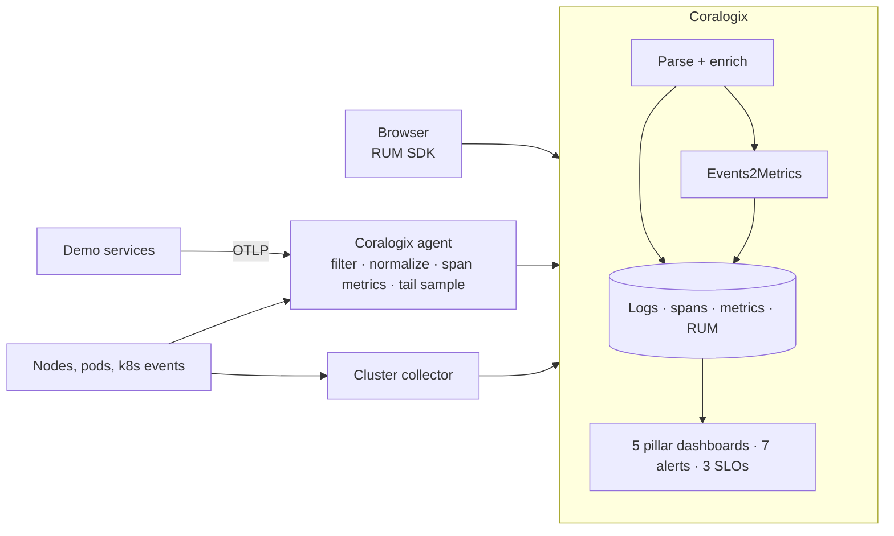

# Option C: compact overview

```mermaid
flowchart LR
  browser["Browser<br/>RUM SDK"] --> cx
  svcs["Demo services"] -- "OTLP" --> agent["Coralogix agent<br/>filter · normalize · span metrics · tail sample"]
  infra["Nodes, pods, k8s events"] --> agent
  infra --> cc["Cluster collector"]
  agent --> cx
  cc --> cx
  subgraph cx["Coralogix"]
    direction TB
    p["Parse + enrich"] --> e["Events2Metrics"]
    p --> s[("Logs · spans · metrics · RUM")]
    e --> s
    s --> o["5 pillar dashboards · 7 alerts · 3 SLOs"]
  end
```
